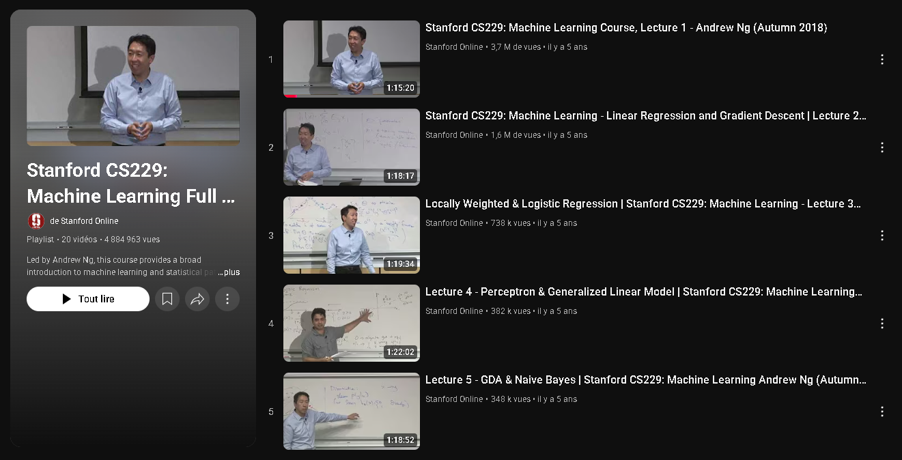

# Stanford CS229: Machine Learning (Notes)

This repository documents my journey through the **Stanford CS229: Machine Learning** course, taught by **Andrew Ng**. The lectures provide a comprehensive introduction to machine learning and statistical pattern recognition, covering both theory and practical algorithms.

## About the Course

CS229 is one of the most influential machine learning courses, originally offered at Stanford University. It covers fundamental ML concepts such as:

* Linear and logistic regression
* Generative and discriminative models
* Neural networks and deep learning foundations
* Support Vector Machines (SVMs)
* Expectation-Maximization (EM)
* Reinforcement learning
* Unsupervised learning

The lectures are publicly available through [Stanford Online’s YouTube playlist](https://www.youtube.com/playlist?list=PLoROMvodv4rMiGQp3WXShtMGgzqpfVfbU).

## Purpose of This Repository

The goal of this repo is to:

* Keep track of the lectures I watched.
* Share **personal notes** I took while studying.
* Summarize key insights, examples, and explanations in my own words.

It is not a replacement for the course itself, but rather a companion for my learning process.

## Structure

* `notes/` → My lecture notes (organized by lecture number).
* `summaries/` → Condensed overviews for revision. (soon)
* `references/` → Links and extra resources I used alongside the course. (soon)

## Acknowledgment

All credit for the course content goes to **Stanford University** and **Andrew Ng**. This repository only reflects my personal learning notes.

